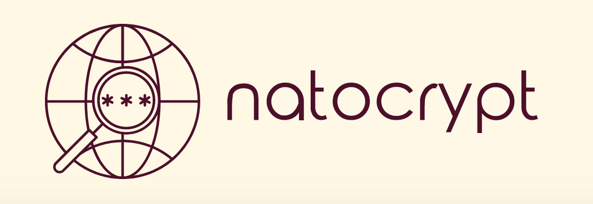

<p align="center">
  
</p>


[](https://nodei.co/npm/natocrypt/)

> A simple library for hashing passwords or text.

- Very simple and easy encryption
- Uses the NATO phonetic alphabet for hashing

Explore natocrypt [here](https://github.com/kemaldemirgil/natocrypt). \
Learn more about [NATO Phonetic Alphabet](https://en.wikipedia.org/wiki/NATO_phonetic_alphabet)

### This package is open to contributions.

## 🔧Installation:

Dependencies:

- NodeJS

```console
npm install natocrypt
```

## 📜Usage:

```javaScript
const Natocrypt = require("natocrypt")
const nato = new Natocrypt();
const somePassword = "$0m3p4$$w0rD";
```

## 🔒Hash a password/text

```javaScript
const encryptedText = nato.encrypt(somePassword)
// encryptedText = { field: 'golfquebecxrayjulietalphajulietechozulufoxtrotsierrawhiskeybravohoteltangosierrasierrabravogolflimaalpha$bravoxraywhiskeyindiaviktornovemberromeoxraycharliexraytangouniformjulietxraygolfwhiskeylimajulietxraywhiskey0deltaalphanovemberbravokiloxrayechoyankeesierrapapadeltadeltalimapapauniformgolfjulietpapaviktoryankeemiketangozulupaparomeoviktorromeoromeoxraydeltaquebecdeltacharliexrayviktorgolfoscarcharliewhiskeykilopapa3novemberalphaalphahotelechosierraalphacharliezuluyankeecharliealphahotelbravoquebecfoxtrotalphayankeecharlieviktorpapaviktorsierraechoyankeezuluquebecfoxtrotviktormikebravoechomikejulietechocharlielimahotelkilooscaroscar4limacharliesierraoscardeltapapaxrayzuluyankeebravooscaruniformalphasierrabravozuludeltasierraoscarfoxtrot$deltasierrapapahotelviktorhoteluniformechoyankeeyankeemikezuluindiatangodeltaquebeckiloxraycharlienovember$tangohoteluniformpaparomeofoxtrotromeosierrabravowhiskeyjulietoscaryankeemikesierradeltaviktorromeolimapapawhiskeymikecharlietangotangoxrayuniformmikelimakiloxrayviktorzulumikepapalimajulietwhiskeyxrayalphaquebec0novemberromeokilonovembermikexraymikeviktoryankeegolflimaindiaviktornovemberbravowhiskeyzuluromeoviktorjulietromeosierrapapaalphanovemberoscarwhiskeyviktorjulietuniformhotellimatangodeltafoxtrothotelgolfechocharlieechodeltaDelta', multiplier: 20 }
```

## 🔓Decrypt a text

```javaScript

const decryptedText = nato.decrypt(encryptedText)
// decryptedText = $0m3p4$$w0rD
```

## ✔️Check a password

```javaScript
const result  = nato.compare("some other text", encryptedText)
// result = false
```

```js
Available Characters = " 1234567890-=,./;'`[]<>?:{}!@#$%^&*()_+abcdefghijklmnopqrstuvwxyzABCDEFGHIJKLMNOPQRSTUVWXYZ"
```

## 🧂Multipliers

On every encryption, a multiplier will be set be default between 3 and 100. Each multiplier value will make the encryption larger. You could also set a multiplier of your own.

> Pass in a multiplier value to the encryption method

```js
const encryptedText = nato.encrypt(somePassword, 50);
```

## 📑API

`natocrypt`

- `encrypt(field, multiplier)`

  - field - [REQUIRED] - input for the data
  - multiplier - [OPTIONAL] - hash length (default 3-100)

  `return - encrypted object`

- `decrypt(field)`

  - field - [REQUIRED] - input for the data

  `return - decryped string`

- `compare(field, hash)`

  - field - [REQUIRED] - input for the data
  - hash - [REQUIRED] - encrypted text

  `return - boolean result`

## 📝Hash Info

Each letter will be a representation of its NATO alphabet. Any other character will be as it is except for spaces. Spaces will be converted to `"~"`, which is excluded from any possible allowed characters. Paragraphs are accepted, however the recommended multiplier value is lower for longer text.

> NATO Phonetic Alphabet

| Alpha | Beta | Charlie | Delta | Echo | Foxtrot | Golf | Hotel | India | Juliet |
| :---: | :--: | :-----: | :---: | :--: | :-----: | :--: | :---: | :---: | :----: |
|   A   |  B   |    C    |   D   |  E   |    F    |  G   |   H   |   I   |   J    |

| Kilo | Lima | Mike | November | Oscar | Papa | Quebec | Romeo | Sierra | Tango |
| :--: | :--: | :--: | :------: | :---: | :--: | :----: | :---: | :----: | :---: |
|  K   |  L   |  M   |    N     |   O   |  P   |   Q    |   R   |   S    |   T   |

| Uniform | Viktor | Whiskey | Xray | Yankee | Zulu |
| :-----: | :----: | :-----: | :--: | :----: | :--: |
|    U    |   V    |    W    |  X   |   Y    |  Z   |

`example`

```
foxtrotechoindiaxraytangoalphapapamikeindiapapasierralimagolfecho
   |     |    |   |    |   |    |   |    |   |    |    |   |   |
  hash   e  hash  x   hash a  hash  m  hash  p  hash   l  hash e
         ^        ^        ^        ^        ^         ^       ^
```

> Hash length depends on the multiplier value.

## 📌Notes:

This package is just the starting of an idea that could grow up into a much secure solution.

Any contributions are greatly welcomed, please provide a detailed explanation of the feature you would like to add, make sure tests are running well before creating a pull request.

If you are submitting a bug or an issue, please provide a sufficient code snippet. Enough information should be provided such that the problem can be replicable. Issues which are closed without resolution often lack required information for replication.

## ©️License:

Copyright © Kemal Demirgil. All rights reserved.
Licensed under the [MIT](https://github.com/kemaldemirgil/natocrypt/blob/main/LICENSE) license.
